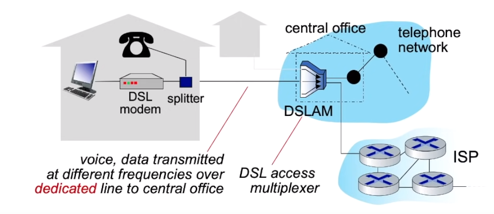
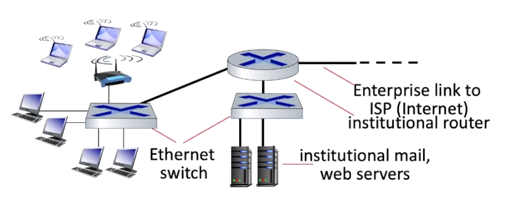
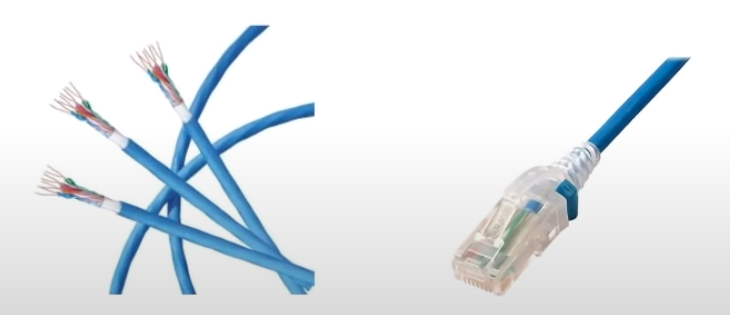
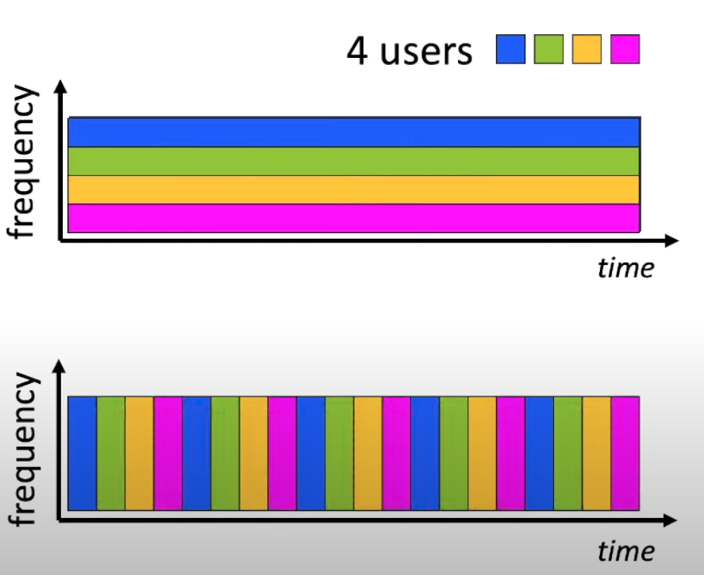
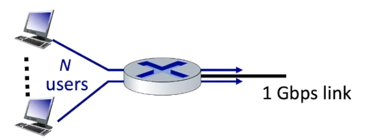

# Network Algorithms
[Playlist of Jim Kurose course](https://youtube.com/playlist?list=PLOsilMR_Br3aXSpaWNSMSLU7YIIUFqHKj)

# Lecture 1
## 1.1 Introduction - What is the Internet?
### The Internet: a "nuts and bolts" view

#### Internet's edge
There are billions of connected computing devices:
- *hosts* = end systems
- running network *apps* at Internet's "edge"

#### Packet switches
They forward packets (chunks of data):
- routers, switches

#### Communication links:
- fiber, copper, radio, satellite
- transmission rate: bandwidth

#### Networks
- collection of devices, routers, links: managed by an organization

#### Internet is the *network of networks*

#### Protocols
are everywhere:
- control sending, receiving of messages
- e.g., HTTP, streaming video, Skype, TCP, IP, WiFi, 4G, Ethernet

#### Internet Standards
- RFC: Request for Comments
- IETF: Internet Engineering Task Force

### The Internet: a "services" view

#### Infrastructure
that provides services to applications:
- Web, streaming video, multimedia, teleconferencing, email, inter-connected appliances

#### Programming interface
- Provides "hooks" that allow (sending/receiving apps) to "connect" to, use Internet transport service
- Provides service options, analogous to postal service

### What's a protocol?
#### Human protocols:
- What's the time?
  - Do you have the time?
  - Yes, it's 9 p.m.
- Questions
  - Are there any questions?
  - Yes, *raises hand*
  - My question is ...
  - Thanks, the answer is ...

So a protocol is:
- rules for specific messages sent
- rules for specific actions taken, when message received, or other events

#### Internet protocols
Are analogous to human protocols, except:
- Replace humans with computers (devices)
- All communication activity in Internet is governed by protocols

#### Final definition
**Protocols** define the **format**, **order** of **messages sent and received** among network entities, and
**actions taken** on message transmission, receipt.

### Overview
- What is the Internet?
- What is a protocol?

## 1.2. The network edge
### Network edge:
- hosts: clients and servers
  - they are called "hosts" because they host or run network applications
- servers often in data centers

### Access networks and physical media
#### How to connect end systems to edge router?
3 types of access networks:
- residential access nets
- institutional access networks (school, company)
- mobile access network (WiFi, 4G/5G)

#### What to look for?
- transmission rate (bits per second) of access network?
- shared or dedicated access among users?

#### Examples of residential access nets

##### Cable-based access

Frequency division multiplexing (FDM): different channels transmitted in different frequency bands.

###### HFC: hybrid fiber coax
- asymmetric: up to 40Mbps - 1.2 Gbps downstream transmission rate, 30-100 Mbps upstream transmission rate
  - downstream means TO HOME, upstream - FROM HOME
Homes *share access network* to cable headend.

##### Digital subscriber line (DSL)

- use exising telephone line to central office DSLAM
- not shared between neighbors
- 24-52 Mbps downstream rate
- 3.5-16 Mbps upstream rate

##### How home networks look like?

#### Wireless access networks
There are two classes:
- Wireless local are networks (WLANs)
- Wide-area cellular access networks

Both connect end system to router
- via base station aka "access point"

##### WLANs
- typically within or around building (~30m)
- Operate in different speeds: 11, 54, 450 Mbps transmission rate

##### Wide-area cellular access networks
- provided by mobile, cellular network operator (10's km)
- 10's Mbps
- 4G cellular networks (5G coming)

#### Enterprise networks

- companies, universities, etc
- mix of wired, wireless, connecting a mix of switches and routers

#### Data center networks
- high-bandwidth links (10s to 100s Gbps) connect hundreds to thousands of servers together, and to Internet

### Host: sends packets of data
host sending function:
- takes application message
- breaks into chunks, packets, of length *L* bits
- transmits packet into access network at *transmission rate R*
  - link transmission rate, aka link *capacity, aka link bandwidth*

packet transmission delay = time needed to transmit packet into link = *L / R*

### Links: physical media
- bit: propagates between transmitter / receiver pairs
- physical link: what lies between transmitter & receiver
- guided media:
  - signals propagate in solid media: copper, fiber, coax
- unguided media:
  - signals propagate freely, e.g., radio

#### Twisted pair (TP)
- 2 insulated copper wires
  - Category 5: 100 Mbps, 1 Gbps Ethernet
  - Category 6: 10 Gbps Ethernet

#### Coaxial cable
- two concentric copper conductors
- bidirectional
- broadband:
  - multiple frequency channels on cable
  - 100's Mbps per channel

#### Fiber optic cable:
- glass fiber carrying light pulses, each pulse a bit
- high-speed operation:
  - high-speed point-to-point transmission (10's - 100's Gbps)
- low error rate:
  - repeaters spaced far apart
  - immune to electromagnetic noise

#### Wireless radio
- signal carried in various "bands" in electromagnetic spectrum
- no physical wire
- broadcast, "half-duplex" (sender to receiver)
- prone to environment effects:
  - reflection
  - obstruction by objects
  - interference / noise

##### Radio link types
- Wireless LAN (WiFi)
  - 10-100's Mbps; 10's of meters
- wide-area (4G cellular)
  - 10's Mbps over ~10 Km
- Bluetooth: cable replacement
  - short distances, limited rates
- Terrestrial microwave
  - point-to-point; 45 Mbps channels
- Satellite
  - up to 45 Mbps per channel
  - 270 msec end-end delay

## 1.3 Network core: packet/circuit switching, internet structure

### The network core
- mesh of routers connected with links
- **packet-switching**: hosts break application-layer messages into packets
  - network *forwards* packets from one router to the next, across links on path from *source to destination*

### Two key network-core functions

#### Forwarding
- aka "switching"
- **local** action: move arriving packets from router's input link to appropriate router output link

#### Routing
- **global** action: determine source-destination paths taken by packets
- routing algorithms

### Packet-switching: store-and-forward

Entire packet must arrive at router before it can be transmitted on next link.

### Packet-switching: queueing

If arrival rate (in bps) to links exceeds transmission rate (bps) of link for some period of time:
- packets will queue, waiting to be transmitted on output link
- packets can be dropped (lost) if memory (buffer) in router fills up

### Alternative to packet switching: circuit switching
end-end resources allocated to, reserved for "call" between source and destination.

Link capacity is reserved exclusively for the call:
- no queueing
- no delay except for the propagation delay
- no loss of data

Cons:
- circuit segment idle if not used by call (no sharing)

#### Circuit switching: FDM and TDM

##### Frequency Division Multiplexing
- frequencies divided into frequency bands
- each call allocated its own band, can transmit at max rate of that band

##### Time Division Multiplexing (TDM)
- time divided into slots
- each call allocated periodic slot(s), can transmit at maximum rate of frequency band only during its time slot(s)

### Packet switching vs circuit switching

Example:
- 1 Gb/s link
- each user:
  - 100 Mb/s when "active"
  - active 10% of time

Q: how many users can use this network under circuit-switching and packet switching?

- circuit-switching: 10 users
- packet switching: with 35 users, probability of > 10 active at same time is less than 0.004

#### Is packet switching a winner?
- great for "bursty" data - sometimes has data to send, but at other times not
  - resource sharing
  - simpler, no call setup
- **excessive congestion possible**: packet delay and loss due to buffer overflow
  - protocols needed for reliable data transfer, congestion control
- **Q: How to provide circuit-like behavior with packet-switching?**
  - It's complicated. There are various techniques that try to make packet switching as "circuit-like" as possible.

### Internet structure: a *network of networks*

- On the edge of the internet there are *access networks*.
- They are interconnected via global ISP (global backbone networks)
  - There are multiples of them because they are competitors
- Global ISP are connected using peering links
  - Locations where they are connected are called IXP: Internet exchange points
- Lots of access nets are connected to **regional ISP** first.
- There also exist **Content provider network**
  - Google, Microsoft, etc, run their own global networks to bring their content close to the end users.

At *center*: small number of well-connected large networks
- tier-1 commercial ISPs (e.g., Level 3, Sprint, AT&T, NTT), national & international coverage
- content provider networks (e.g., Google, Facebook): private network that connects its data centers to Internet, often bypassing tier-1, regional ISPs

### Overview of the Network core:
- forwarding, routing
- packet switching
  - store-and-forward
  - queueing delays
  - packet loss
- circuit switching
  - vs packet switching
- structure of today's internet
  - network of networks
